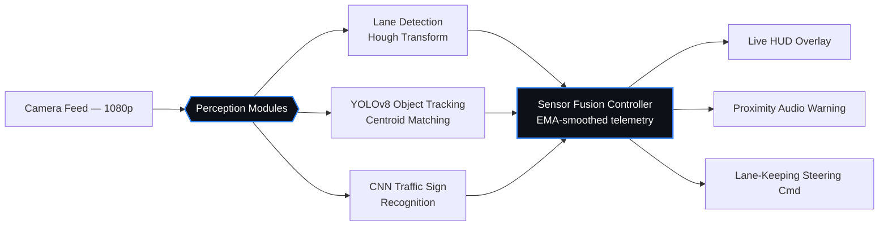

<div align="center">


# Sakthivel S V
**Full-Stack Developer · Computer Vision · Applied Security**

[](https://git.io/typing-svg)

<br/>

[](https://github.com/SpoodermanCodes)
[](mailto:svsakthivel716@gmail.com)
[](https://linkedin.com/)


</div>
<br/>

---

### `01` — init

```yaml
name:       Sakthivel S V
handle:     "@SpoodermanCodes"
location:   Coimbatore, India
education:  B.Tech IT @ Coimbatore Institute of Technology — CGPA 8.39/10 (6th sem)
focus:      Full-Stack Development · Computer Vision · Applied Security
building:   Real-time perception systems, RAG-powered apps, OSINT tooling
fun_fact:   "Still in undergrad, already shipping production-grade demos."
```

---

### `02` — arsenal

<div align="center">

**Languages**
<br/>


<br/><br/>

**Frameworks & Runtime**
<br/>


<br/><br/>

**Data & Infrastructure**
<br/>


</div>

---

### `03` — pipeline

The shape of my flagship project — a real-time ADAS stack where multiple perception modules feed a single fusion controller before anything reaches the driver.



96.2% lane detection accuracy at 34 FPS · 95.8% tracking precision at 29ms/frame · ±0.58m distance error · ±0.24s TTC error.

---

### `04` — projects

<table>
<tr>
<td width="33%" valign="top">

**🚗 ADAS Real-Time Pipeline**
<br/>
<sub>Python · YOLOv8 · OpenCV · PyTorch</sub>

Lane detection, object tracking, sign recognition, and TTC forecasting fused into live HUD overlays and steering commands.

[](https://github.com/SpoodermanCodes/adas-driver-assistance-system)

</td>
<td width="33%" valign="top">

**🔎 OSINT Intelligence Framework**
<br/>
<sub>TypeScript · Node.js · Playwright · Express</sub>

Multi-source identity aggregation across 11 public sources with Levenshtein-based clustering and Redis-backed caching (87% hit rate).

[](https://github.com/SpoodermanCodes/osint-eye)

</td>
<td width="33%" valign="top">

**🖥️ GPU E-Commerce Store**
<br/>
<sub>Next.js · PostgreSQL · pgvector · OpenAI</sub>

Semantic vector search across 100+ GPU/CPU/motherboard listings with RAG-driven recommendations and a 96 Lighthouse score.

[](https://github.com/SpoodermanCodes/duncan)

</td>
</tr>
</table>

<div align="center">
<sub>Also shipped: <a href="https://github.com/SpoodermanCodes/2d-archive">2d-archive</a> — a retro arcade platform (Snake, Pong, Tetris, Flappy Bird, Space Invaders) with real-time 1v1 multiplayer · <a href="https://github.com/SpoodermanCodes/rural-health-connect">rural-health-connect</a> — a 3-portal rural healthcare system with AI-powered monitoring</sub>
</div>

---

### `05` — tools & infrastructure

<div align="center">

<table>
<tr>
<td align="center" width="80"><br/><sub>Docker</sub></td>
<td align="center" width="80"><br/><sub>PostgreSQL</sub></td>
<td align="center" width="80"><br/><sub>MongoDB</sub></td>
<td align="center" width="80"><br/><sub>MySQL</sub></td>
<td align="center" width="80"><br/><sub>Redis</sub></td>
<td align="center" width="80"><br/><sub>Firebase</sub></td>
<td align="center" width="80"><br/><sub>Git</sub></td>
<td align="center" width="80"><br/><sub>Unity</sub></td>
</tr>
</table>

</div>

---

### `06` — security & interests

<div align="center">

**Security Tools** <sub>(familiar with)</sub>
<br/>


<br/><br/>

**Areas of Interest**
<br/>


</div>

---

### `07` — achievements

| | |
|---|---|
| 🏆 **Smart India Hackathon** | 1st place (2025) · 3rd place (2024) — combined ₹6,500 prize pool |
| 🌐 **AstroNova Symposium** | Volunteer web developer — built the official site for this national-level college tech symposium |

---

### `08` — connect

<div align="center">

[](https://github.com/SpoodermanCodes)
[](mailto:svsakthivel716@gmail.com)
[](https://linkedin.com/)

<sub>Open to conversations about full-stack systems, computer vision, and security-minded engineering.</sub>
<br/>
<sub>© Sakthivel S V — building in public, breaking things responsibly.</sub>

</div>

---

### `09` — github stats

<div align="center">


<br/><br/>


</div>
